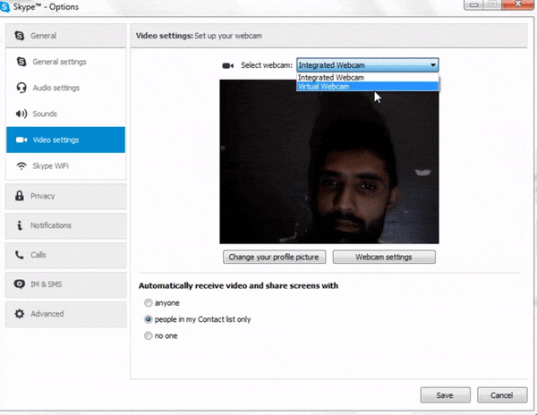

# Virtual-Webcam

A Virtual Webcam combined with Face Tracker (_camshift_) for Windows. It appears just like a normal webcam to applications like Skype and Hangouts but you can control its input video source (video file, actual webcam etc.) or you can apply visual effects in between source and destination of video. 

**Live demo**

## Getting Started

There is an installer folder containing an .exe file that you can use to install virutal webcam or it contains all the necessary files to generate a new installer if you want.

If you want to install it manually then please follow the steps mentioned below.

1. Open command line with admin rights.
2. Go to directory where output files (VCam.ax and VCamD.ax) are present (they are present in this repo already or you can generate yourself by updating code).
3. Use "regsvr32 VCam.ax" to install Virtual Webcam
4. Use "regsvr32 /u VCam.ax" to uninstall virtual webcam.

## Dependencies 

- It uses directshow so directshow paths must be set.
- It uses OpenCV so OpenCV must be configured.

## Possible Issues and Improvements

- I worked on it few years back so it is not up to date so it can definitely be improved and upgraded.
- At the time it was tested on Windows 7 and Windows 8 only.
